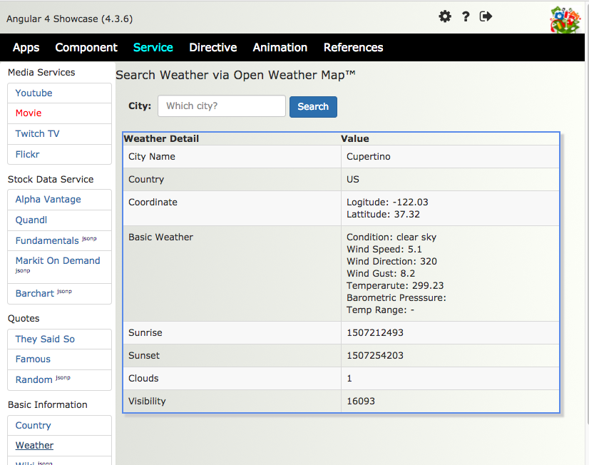
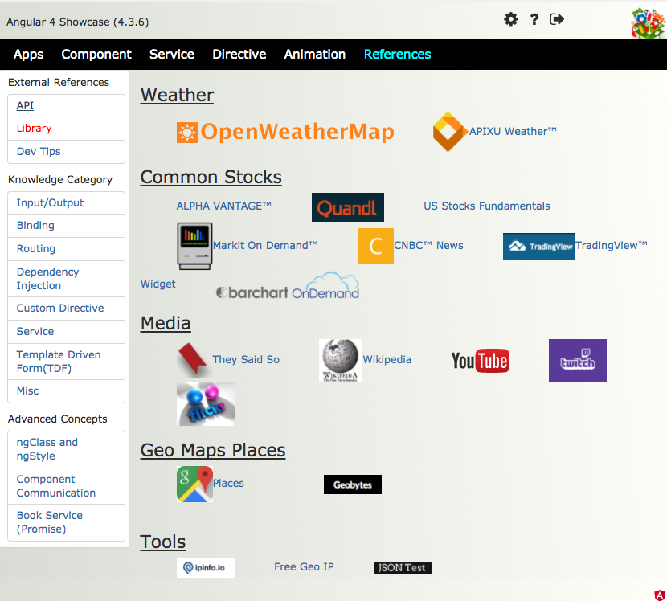

# Showcase
This project came about because of so many small programs that I wrote during the past 16 months are scattered 
everywhere, it is very difficult to find what I learned during this intensive learning period.  I often remember
something I did that maybe useful int the new project, but it takes too long to find them both for presentation
and underline code.  They are scattered in many folders  across several drives.  One day it dawns upon me; hey I'm
learning how to code web pages, why not put them behind pages and a few clicks will find what I want.  This definitely
beats looking at folders after folders in finder followed by copying over code and run under Webstorm.  That's when
this "showcase" idea becomes meaningful.  First of all, I have one place to look for dev information, better search,
central storage.  Added benefits are for easy demonstration to others.  Obviously it's not meant for large apps with
multiple pages and special backend.  But for basic dev information, this should beat google search.

This project is still alive and growing, probably forever.


## Goals
1. To provide a way to reference Angular 4 dev information very quickly
2. To access code associated with specific topics
3. To provide a view for others to know about my capabilities
4. To serve as a log of my learning journey


## Sample Screen Shots








## Dev Logs
[2017-08-26]
- Build up the framework with top level routing with components
- Design "Service" tab content; mainly moving open weather map sample to one of the API samples
- Design a general purpose widget for left nav, but implement a basic one first inside service tab
   since a lot needs to be learned about making directives and children routes
- Merge Open Weather Map API and search form from VCE app into first service item still using 
   boostrap grid
[2017-08-27]
- Create/merge youtube sample into second service item with 20 videos per request, only search function
- Change top right menu items to fa icons
- Created "Country Service" from API 'restcountries.eu', allows query for individual country information
- Adapt new strategy for service, have real Angular services do dirty work, hooking up HTTP instead
  doing it within components, adapted weather client and youtube client
[2017-08-28]
- Created JSON test service with IP, date, time, echo and header services  
[2017-08-29]
- Integrated with 3rd party map component AGM on service tab with places search capability
[2017-08-30]
- Found out about geobytes.org which has a rich set of free services, create a client and service to access its data
- Inspired by math service in Angular 1 class, actually created a sample there, now do this in Angular 4 service
[2017-08-31]
- Migrate original tic-tac-toe into "Components" tab, reduced to 1 player only
- Migrated my-blog into "Components" tab with minor styling
- Migrated calculator app into "Components" tab
- Created a new top level "Apps" tab to house apps that are more than just a component
[2017-09-01]
- Migrated twitch-TV app from A1 set over 
- Start working with ng2-admin on a different project but it was created from A2 environment
- Start porting badge system, probably won't finish today
[2017-09-02]
- Completed migrating badge system, redesign header, photo block, search methods ignoring case, show
  user w/o photo, all original features ported
[2017-09-03]
 - Use ngOnInit() to load original content on all service items with API access (weather, youtube, country,
  twitch), it turns out to be very easy
 - Fine tune youtube and twitch to make them look nicer; {remove empty margin/padding imposed by bootstrap,
  twitch show profile/video banner whichever is available, add tooltip..etc}
 - Some challenges with AGM map, more studies needed
 - Port over original weather card partially, google map / places is the big challenge, defer to future
 - Attempt to start porting wiki search pages since its API exercise, ran into problem with JSONP
 - Ported flickr API service / client to A4, but infinite scroll is still unknown
So far, 15 small apps are ported over.
[2017-09-04] Holiday, not for me
 - Add library lightbox2 to flickr service client and badge app
 - Google map doesn't work in service tab in a strange way, so I use a separate project to 
   learn to create new one and it works, now bring back in
 - Google places API is nicely wrapped in A4 directive ng4-geoautocomplete which works amazing
   well in A4
[2017-09-05]
 - Merge part of famous quotes into component package
 - Discover A4 can use setTimeout() and setInterval(), rework on pomodoro to fix it. 
   It turns out new Audio() also works. Now adjust button positions, digit positions/sizes to
   look better in the showcase; also attempt to rotate stargate slowly when timer is going;
   learning how to use A4 animation tools.
[2017-09-06] 5.5
 - Create a service for stack exchange and a demo page under service tab {1.5h}
 - Merge Bo's implementation of ng2-admin onto A4 version on pc, get to log in screen {3hr}
 - Attempt to run ng2-admin on MAC, not yet {0.5h}
 - Edit Pomodoro stargate to remove background and make it rotate 10 minutes {0.5h}
[2017-09-07] 3.5
 - Re-arranged menu {0.5h}
 - Attempt to port Chart.js and TradingView examples over, but the former needs a lot of learning
   and the latter was a strange one using embedded JS to generate DOM element which doesn't work under A4 {1h}
 - Start A4 animation experimentation under "Basic" item of Animation tab, familiarize with basic syntax {2h}
[2017-09-08] 5
 - Continue A4 animation with keyframe {1h}
 - Add more flickr API service based on general search, it uses "method" for search, so I added search box {1h}
 - By accident found alpha advantage with EOD data via JSON, build a page for it, default goes back 100days in compact mode, 
   very pleasant surprise. There is hope to build my own algo/charts with EOD EOW {2h}
 - Dig up older CSS animation using cars, add a few more, now 10 cars, plan to use staggered animation to make them start
   differently and vary their speeds {1h}
[2017-09-09] 2.5
 - Test out webstorm's refactoring facilities - re-org tool folder into sub-folders: app/geo/info/media/stock {0.5h}
 - Add service to quandl and usfundamental to stock service group {1h}
 - Also create clients for quandl and fundamental {1h}
[2017-09-10] 2.5
 - Finally got fundamentals to work - successfully getting 12691 companies ID/name at init time, also was able to limit
   number of records displayed using ngIf under the loop and slice:0:10 special filter not in docs {0.5h}
 - Extend functionality of fundamentals to subset of companies, show fixed set of indicators and also query for
   huge list of indicator metadata {1h}
 - Implement markitondemand service/client by turning off CORS on browser {0.5h}
 - Mimic one youtube example of stagger animation, almost duplicating it as part of learning process {0.5h}
[2017-09-11] 2.5
 - Attempt to port Alchemy service over but unfortunately it's JSONP and not working, also invalid API key {1h}
 - Refactor packages under services to be more manageable using nice re-factor tools {0.5h}
 - Start converting simon game, lots of code and some angular.element needs to be handled differently {0.5h}
 - Mark left nav items RED to indicate incomplete features, still quite a few {0.5h}
[2017-09-12] 2
 - Listen to a few CSS videos, dup them here
 - Split animation tab into multiple CSS and Angular for daily additions {0.5h}
 - Able to get Geobytes city search to work via JSONP wow, the first time {1h}
 - Attempt to type in Devtips' drop down menu but CSS was too complex, end up just download from codepen [0.5h}
[2017-09-13] 5
 - Trial and error on wiki string, actually works, put some data to view {1h}
 - Polish up geobytes and wiki client pages {0.5h}
 - Learned the way to fly in text via animation, really just by removing a hidden class under CSS {0.5h}
 - Learned putting video playing in the background under PV CSS, but it doesn't loop {0.5h}
 - Could not set table column width effectively {0.5h}
 - Attempt to move fly in animation into A4, unable to start transition using CSS animation {0.5h}
 - Move quote services into different service group, re-package {0.5h}
 - Reduce panel-heading/panel-body space {0.5h}
 - Attempt to get quote from forismatic.com but it needs jsonp {0.5h}
[2017-09-14] 3.5
 - Start 1st directive practice, learned lightpurple, lightbrown don't work in setting background
   attributes, use #xxxxx always {0.5h}
 - Add color customization to this hoverColor directive via custom attrib enterColor. MUST use
   [enterColor]="'#f802f3'", note single quote inside double quote to work.  Video suggested not
   using square bracket that doesn't work. Tried advanced approach where 1st parameter can be the
   same as directive name and others can be specified next {1h}
 - Completed JSONP (3rd one) with florismatic random quotes, thanks to "JSONP_CALLBACK&" string {0.5h}
 - Adjust layout of Simon's UI, they look nice now, but not functional yet {0.5h}
 - Move basic Barchart code into A4, test ok under NO CORS, but jsonp format is unknown {0.5h}
 - Add tiny jsonp string to the end of each service client that has CORS problem, total of 7, 3 already
   have successful JSONP response.
 - Move some "Component" items to "Apps" such as Weather, Calc, TTT, Pomodoro, consider not having this
   menu, refactoring is great in Webstorm {0.5h}
[2017-09-15] 3
 - Studied basic animation theory, learned a few ideas never know before: transition in CSS is meant to
   smooth associated property change over time instead of sudden jump; keyframes are used to fine tune
   transition {2h}
 - Able to run tour of heros sample by copying all files under app folder and add one library 
   "angular-in-memory-web-api" from npm. {0.5h}
 - Learn more basic CSS transition, experiment with basic concepts{0.5h}
[2017-09-16] 3
 - Animating CSS bubbles under CSS advanced menu {1h}
 - Trying to create a new directive called [appAutogrow] but html won't allow it {0.5h}
 - Expriment with not using bracket, seems to help, but strangely it only works with button elemnt{0.5h}
 - If I add id to button, even though focus class was added, but id seems to take precedence. INDEED,
   by the CSS rule, ID is more important than class. So change ID to class, then it works.
 - But <div> or <p> don't react to click, probably they won't go into focus when click, try input tag {0.5h}
 - Add new top level menu "Reference" for keeping helpful external resources.  Starts with API documents {0.5h}
[2017-09-17] 1.5
 - Animate directive is not easy, needs new AnimationBuilder another learning process. In the meantime, use
   the parent container to animate children, add animation to directives{1h}
 - Add a few more API logos to reference page {0.5h}
[2017-09-19] 2.5
 - Experiment some animations with query, repackage, fix bug visible/show, figure out how to animate from 
   void to initial state over 5s, this works for any component on load time, fine tune bouncing ball{2.5h} 
[2017-09-20] 1
 - Experiment with fly in list, but not able to see animation {1h] (https://alligator.io/angular/animation-angular/) 
[2017-09-21] 4
 - Add 3 variations of DOM binding to reference menu/tips {1h}
 - Move all routes (100+) outside app.module.ts into a const file {0.2h}
 - put AGM inside Component/3rd Party menu with icon link inside map to site {0.2h}
 - Created Advanced sample of component communication using AU's example, {2h}
 - Also tried dialog ng2-opd-popup got a lot of errors under cli, postpone{0.5h}
[2017-09-22] 2.5h
 - Practice AU's attribute directive, put inside directive area, can hide once and can't click
   again. Something to do with CSS{1h}
 - chrome dev tool $0 - last element clicked
 - Misc DOM property [disabled] for button; [required]="true" for input; [style.background]="red"
   for any element; [hidden]="true" for any element
 - For interpolation inside double curly, one can put in a function like {{doSomething()}}, another
   way to write this w/o parenthsis is to use getter like this:
       get doSomething() {....}  
 - Another trick with interpolation when vm doesn't exist: {{vm.doSomething()}} will throw error
   But if we use "Elvis Operator" => ? inside double curly like {{vm?.doSomething}}, error will
   be eliminated and nothing is evaluated.  Additionally {{vm?doSomething || 'Default Value'}} can
   output default value and won't show blank.
 - Debug TS file; in tsconfig.json add this line "sourceMap": true
 - Help debugging; use JSON pipe inside interpolation
 - ngProbe; state of any component in comp tree
 - Augury for chrome and misc learning {1h}
 In Flight to Taiwan
 - write zoom-hover directive for 3 widgets and div w customizable font size {0.5h}
[2017-09-25] 2h
 - Worked on shopping project all yesterday during transit.
 - Learn to use Promise with HTTP service, start with simulated delay on JSON file
 - Then use this on github and iTunes, by default they are Observable, but HTTP can be just
   Promise.
[2017-09-26] 3h
 - Due to jet lag, was not able to hold for long time, but managed to make github observable
   to work yesterday, somehow the promise version does not work
 - Found an example of promise reading JSON via HTTP, type it in and put under reference menu{2h}   
 - Now attempt to make it work again under github, actually worked using the reference example
 - Next change layout to make page look better, horay promise works...{1h}
[2017-09-30] 3h
 Coming back to this project after heavy duty 12 days porting shopping app over to A4. The plan is
 to continue this learning path/app 2 hours each day.  What to learn? go back to all youtube's 
 "Angular tutorial" vidoes quickly and see if I can pickup anything that was missed before.  I was
 surprised to learn new things while listening "kudevenkat" videos every time. They are not big
 concepts but small bits and pieces worth noting.  Maybe this app is the good place to keep them
 so that I don't have to go back watching videos any more (and not missing out valuable knowledge) 
 - Watch and collect contents from video 1-21, add to reference menu w 3 selections
 - stuck on video #22, can't speed watch, must watch full {3h} 
[2017-10-01] 2h
 - Successfully finished 30+ videos and captured 99% tidbits and slides from video, put them inside
   showcase{1h}
 - Another hour, reach #40 video, this is done; watch more later on new ones {1h}
[2017-10-02] 0.5h
 Today I spent most day looking at job postings, not much dev, although I got a few ideas from kbvenkat last few
 videos plus the 2nd series.  Also counted number hours records since 9/6 after Satish metioned about 2000 hours
 Between 9/6 and 10/1, I logged 59+32 = 91 hours from both projects, roughly 3.5 weeks so that averages 26 hour/wk
 Extrapolate to my starting point (May 2016), I've accumulated about 1600 hours. The remaining 400 should come in
 about 4 months or roughly end of year.  This means still more proejcts to do.  Don't stop just beacuse I was looking
 for jobs.  Must put in 25+ hour/week.  Not easy for nightly, so must steal time during the day like 2 hr/day. 
 - Add some learned code sample to reference {0.5h}
[2017-10-03] 2h
 - Start learning TDF from Codevolution videos, plan on similar sample inside reference menu with screen shots
   and under advanced samples menu showing real forms {1h}
 - It seems Angular disabled HTML validation (novalidate) and take over the entire validation
 - Finally implemented name field and zipcode field validation {1h} 
[2017-10-04]
 Spent much time looking at jobs, unfortunately the ones I wanted most require heavy industry experience(ironic).
 When one has such experience, those are probably not desirable jobs any more.
 - Watched almost all Xpose's 15 videos, only #13 and #14 taught me something, repro them here (1)ngClass vs ngStyle
   (2) Add level 3 routes w/o component (3)Hyperlink to live sample (4) Capture both #13 and #14, Xpose done {1.5h}
[2017-10-05]
 - Add and update README, sample images, push to github
 
 - Port some old CSS animation over from A1 times
 

## Next Steps
 - Gradually move various reference items down to level 3 routes and folders
 - Need top level search box to quickly navigate to different subjects
 - A searchable by category youtube reference page that can play advanced topics
 - Download really good YT videos and cut out pieces and fit into different parts of showcase; the goal is simple
     fast look up code samples
 - Link from References pages to actual sample; eg. under Ref | API, there are many icons, right click (or double click)
   on Youtube send user to Service | Youtube sample (or open another browser window with it)
 - Make left nav collapsible and re-usable component 
 - Not learned areas ==> MDF/TDF, Validation(Awais, Codevolution), @HostListener(codedamn), 
      @ViewChild(codedamn), ng-container, NgModule(codedamn), Child route/pathMatch(codedamn),
      Firebase(JavaScript Evangelist), Angular Material, MEAN4+
 - keep header fixed in place
 - animate bubbles in A4, Codevolution has many animation videos
 - maybe color wheel directive somebody already wrote? practice more AU samples, put inside references with code
 - parallex, video in background
 - CSS animation one per day, challenges -> A4 ways to swap out CSS classes on the fly
 - make quotes into directive? actually everybody recommends re-useable components and attribute
   directives 
 - beef up quotes.rest/qod to random quotes?
 - add github and iTunes API services
 ??? how to animate inside attribute directive ?
 ??? how to read initial font size using ElementRef.navtiveElement ?
 ??? appHoverColor must have square bracket but appZoomHover doesn't ?
- Show source code next to the view, maybe a popout dialog/window? <pre> pretty code
- Create a system level service for HTTP access (like a singleton or static methods) instead of doing
  all inside components
  
- Future Enhancements:
  - Stock Data: (1)Expand API capabilities (2)use filter formatting (3)User selectable date ranges
      (4)Simple line charts and candle charts (5)Fundamentals search (6)Indicators
      (6)Fundamental - parse blob into meaningful company data presented in table
      (7)load time is still slow for 12691 records, consider using progress bar, get fundamentals...
      (8)Learn ChartJS and show better stock pages
      (9)Embed TradingView chart is difficult inside A4, A1 was done with mixed non-A1 JS, maybe looking for other
           packages such as bigchart.com

  - Weather: (1)owm temperature doesn't look right, sunrise/sunset time either
             (2)weather card - better search using Google places, apixu search may have partial match errors
             (3)Side by side service comparison
  - Country: (1)Autocomplete when typing partial name/code; 
                initially preload all countries at service level, user sees a combo to pick from
             (2)Show multiple results and let user pick from it 
             (3) search by currency code, capital, language
             (4)Search by calling code, region 
             (5)Show google maps
  - Youtube: (1)click image to play video 
             (2)Next page/previous page thumb (bootstrap widget) 
             (3)Nice video player
             (4)Use wiki to search full list of startrek movies "Star Trek (film series)" 
                then show in youtube
  - JSON test: (1) echo out user inputs (2) show all properties in header
  - Tic-Tac-Toe: (1) Intermittently computer player does not put circle on the board
  - Coonect to more API end points
  - Expand google map with various place API, eg. find coffee shop app
  - Calculator: ==> How to manage precision (# decimal places) and max number of digits
                    on LCD, many trailing 0s after decimal doesn’t look good
                	(partially solved using DecimalFormat.js )
                ==> Stop allowing user entry after entering 10 digits
                ==> Why getting NaN occasionally but hard to capture the use case?
                	(1) click digits, +, = (2) … =, +, digits, = 
  - Twitch TV ==> each channel shows a small preview box
  - Badge system ==> search autocomplete with partial last/first name entry
                 ==> adjust photo sizes to have uniform aspect ratio
  - Flickr ==> (1)Next page/Prev page.
               (2)Infinite scroll
               (3)Don't load 5800 images initially   
  - Google Map/Places ==> explore various fancy features  
  - Famous Quotes (1)Ability to tweet the quotes
                  (2)Make this component into a directive    
  - Stack Exchange (1)Learn more about API, add more features
  - Pomodoro ==> use keyframe to animate background spinning forever

  - Left nav should not continue to be 3:9 at bigger size screen, in small screen change to hamburger  
- Add new tab for animation, add massive amount of examples
- Re-arrange menu bar ==> Component | Service | Directive | Basic(binding/pipe/routing) | Apps
- Ideas for routing ==> some images with code next to them, how to do routing; a tab to show image,
  steps to take, a tab for partial code (quick reference), same is true for binding/pipe, terminology
  code sample and live action
- Include Angular material demos
- Ideas for directive ==> samples of small, reusable views w behavior; eg. highlight on hover, popout
  on hover, carousel, skin
- Ideas for apps ==> my shopping site; dance; portfolio, life portal, stock pages 


## Mystery & Challenges
1. [Mystery]Very strangely, when I try to surround top level router-outlet with a div with position absolute, two
   sets of nav bar showed up.  ??? maybe app-root needs to be position: relative????
   ``` 
      <div class="main-view">
         <router-outlet></router-outlet>
      </div>
      
      .main-view {
        position: absolute;
        top: 90px;
        width: 100%;
      }
  ``` ```
2. [Mystery]In country service, somehow "India" can not be retrieved  
3. Both Geobytes and Wiki show CORS and had to use JSONP, not sure how
4. How to do "infinite scroll" on flickr 5800 photos, the first call got all in memory already?
     https://github.com/orizens/ngx-infinite-scroll
5. Sometimes famouse quotes app will get CORS error, may need JSONP?  
6. Stack Exchange - name link does not open properly
7. CORS challenge, need to do something - US fundamentals, geobytes, andruxnet, markit, barchart, alchemy
  
## Knowledge / Observations
1. Bootstrap's grid system limits OWM's left nav either too narrow for 2:8 or too wide for 3:9, a lack
   of resolution
   
2. In order to use Angular Service, a component must import it and declare under @Component section
   as providiers

3. Without ReactiveFormsModule in module.ts, <input> tags with "autocorrect" or "autocapitalize" will
   show error saying "no NgControl"
   
4. Even though copied code is working for google places, but I have trouble understanding how
   it's done, and widget could not search by country rather based on city most of time.  This is because default
   is 'address', change to '(cities)' will bring up any city typed.  Refer to google Places API for detail.

5. For HTTP requests with headers, look at twitch.service.ts for working example.  Basically an object of
   type RequestOptions need to be instantiated with its 'headers' property set to a new Headers object.  It
   didn't work initially because I didn't import Headers and TSLint was referring to another class with errors.

6. Arrow function => is wonderful in ES6 that it does not require callback function to .bind() any more since
   it retains the lexical scope and not assigning new "this" to callback.  This is most notable in weather
   card that it uses 3 level deep http callbacks and this.xxx is still meaningful
   
7. How to find my current angular 4 version?  use browser inspector, look at <app-root>, an attribute called
   ng-version will indicate the version. Or programmatically call VERSION.full at CTOR().  At this point it is 4.3.6.

8. How to clean up subscriptions for all the API connections? Supposedly ngOnDestroy() ?

9. To covert pre-A4 A2 code into A4, have to compare folder by folder, merge manually

10. Alpha Advantage server seems to be slower than Quandl's and date range is not change-able, only compact or full

11. To temporarily work around chrome's CORS rejection on MAC, use this command, then restart chrome
       open -a Google\ Chrome --args --disable-web-security --user-data-dir
       
    How to bring it back? this command only opens 1 browser window with big warning on top, exit browser process
    then restart will stop this behavior  
    
12. Another tool for working around CORS is in chromestore called "", tried long ago but doesn' work  
     https://chrome.google.com/webstore/detail/allow-control-allow-origi/nlfbmbojpeacfghkpbjhddihlkkiljbi?hl=en 

13. US fundamentals API does not come back with JSON for querying company IDs, all 12691 is bundled in one blob under
    private _body attribute of response.  Under A4, must use payload.text() to get to body part. 
    
14. Learned SlicePipe  <expression> | slice:<start index>:<end index> very useful     


15. Forbes sample json
{"thought":{"naturalId":"1","quote":"  Teach self-denial and make its practice pleasure, and you can create for the world a destiny more sublime that ever issued from the brain of the wildest dreamer.","quoteFragment":"Teach self-denial and make its practice...","uri":"1","thoughtAuthor":{"name":"Sir Walter Scott","uri":"sir-walter-scott","image":"sir-walter-scott"},"thoughtThemes":[{"name":"Self","uri":"self"}],"relatedAuthorThoughts":[{"naturalId":"9628","quote":"Those who follow the banners of reason are like the well-disciplined battalions which, wearing a more sober uniform and making a less dazzling show than the light troops commanded by imagination, enjoy more safety, and even more honor, in the conflicts of human life.","quoteFragment":"Those who follow the banners of reason...","uri":"9628","sortField":6,"thoughtAuthor":{"name":"Sir Walter Scott","uri":"sir-walter-scott","image":"sir-walter-scott"},"thoughtThemes":[{"name":"Man","uri":"man"}],"visible":true,"shortUri":"http://onforb.es/TKtK52"}],"relatedThemeThoughts":[{"naturalId":"6612","quote":"We can secure other people’s approval if we do right and try hard; but our own is worth a hundred of it, and no way has been found out of securing that.","quoteFragment":"We can secure other people’s approval if...","uri":"6612","sortField":90,"thoughtAuthor":{"name":"Mark Twain","uri":"mark-twain","image":"mark-twain"},"thoughtThemes":[{"name":"Self","uri":"self"}],"visible":true,"shortUri":"http://onforb.es/TK9fWo"}],"visible":true,"shortUri":"http://onforb.es/TK4kVr"}}

16. A4 animation - very important to import style, trigger, state..etc from right package @angular/animations
    those classes exist in other packages and they create errors.  Also inside style, values MUST be quoted
    Also learned hard way, state 'visible' must be the same as underline variable content, eg. visibility
    must equal to 'visible' to make it work, use 1 or 0 won't.  The string stored in variable is used to 
    compare with state('state name') and transition('state name'), an implicit linkage.
